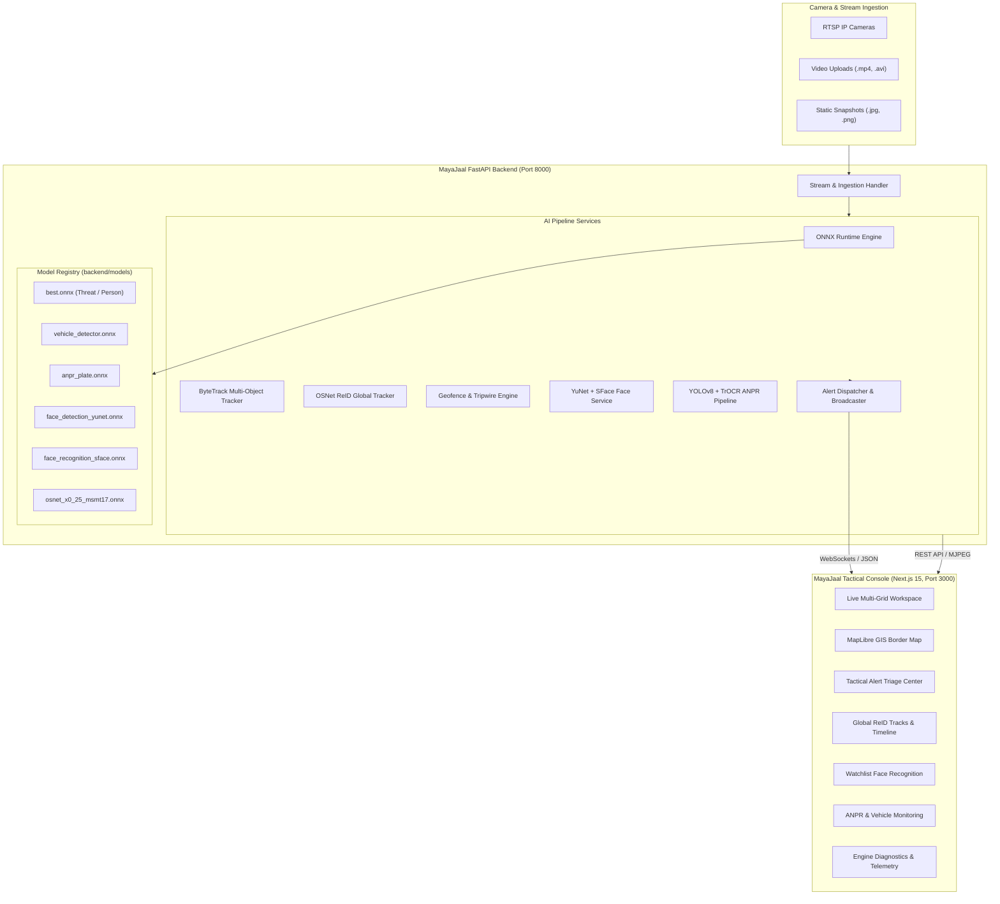

# MayaJaal (Maatrix)
### Intelligent Video Analytics Platform for Border Surveillance
**Smart India Hackathon (Problem Statement: SIH26187)**

[](https://fastapi.tiangolo.com/)
[](https://nextjs.org/)
[](https://react.dev/)
[](https://onnxruntime.ai/)
[](https://opencv.org/)
[](https://www.typescriptlang.org/)
[](https://tailwindcss.com/)

---

## 1. Overview

**MayaJaal (Matrix)** is an enterprise-grade, tactical AI-powered video analytics platform engineered for border security outposts and perimeter surveillance. Designed to integrate directly with existing legacy CCTV and IP camera infrastructure, MayaJaal converts passive video feeds into a proactive, high-precision border defense grid.

The platform provides operators with autonomous multi-threat detection, cross-camera intruder trajectory reconstruction, polygonal perimeter geofencing, facial recognition against national watchlists, automatic number plate recognition (ANPR), and real-time situational awareness on a tactical GIS border map.

---

## 2. Key Capabilities & System Modules

| Module | Engine / Model | Description |
| :--- | :--- | :--- |
| **Tactical Live Surveillance** | OpenCV / WebSockets / RTSP | Low-latency live multi-camera monitoring grid with customizable views (1x1, 2x2, 3x3, custom), PTZ controls, and real-time inference overlays. |
| **Multi-Object Tracking (MOT)** | ByteTrack + Kalman Filter | Real-time person, vehicle, and object tracking with persistent local track IDs and tactical velocity vectors. |
| **Cross-Camera Re-Identification (ReID)** | OSNet (`osnet_x0_25_msmt17.onnx`) | Deep visual appearance feature extraction (512-d embeddings) to correlate and reconstruct global trajectories of targets across non-overlapping camera fields of view. |
| **Virtual Geofencing & Intrusion** | Ray-Casting & Vector Geometry | Polygon restricted zones and polyline directional tripwires with sub-second intrusion detection and automatic snapshot logging. |
| **Facial Recognition (FR)** | YuNet + SFace (`128-d cosine`) | Real-time face detection and 128-dimensional embedding extraction against criminal/terrorist watchlists with continuous background feed scanning. |
| **Automated Number Plate Recognition (ANPR)** | YOLOv8 + TrOCR / EasyOCR | Two-stage vehicle detection and license plate localization with optical character recognition tuned for standard and high-security Indian registration formats. |
| **Tactical GIS Border Map** | MapLibre GL + Geospatial Shapefiles | Interactive situational map plotting India International Land Borders, camera viewing frustums/azimuths, live intruder tracks, and breach zones. |
| **Real-Time Alert Dispatcher** | WebSockets + Push Audio | Sub-second alert broadcast with severity levels (`CRITICAL`, `HIGH`, `MEDIUM`, `LOW`), photographic evidence snapshots, and operator audit trail. |
| **Optimized Inference Engine** | ONNX Runtime (CPU / CUDA) | Thread-bounded inference concurrency, dynamic model loading/caching, and hardware-agnostic acceleration. |

---

## 3. High-Level Architecture



---

## 4. AI Models Specification

All production inference models run through the optimized ONNX Runtime engine located in `backend/models/`:

| Model File | Type | Framework / Source | Purpose |
| :--- | :--- | :--- | :--- |
| `best.onnx` | Object Detection | YOLOv8 | Primary threat detection (person, weapon, tactical objects). |
| `vehicle_detector.onnx` | Object Detection | YOLOv8s | Detects cars, trucks, motorcycles, buses in perimeter zones. |
| `anpr_plate.onnx` | Object Detection | YOLOv8 Custom | High-resolution license plate bounding box localization. |
| `face_detection_yunet.onnx` | Face Detection | OpenCV YuNet | Lightweight, high-precision edge face detector. |
| `face_recognition_sface.onnx` | Face Feature Extractor | OpenCV SFace | 128-dimensional embedding model for watchlist matching. |
| `osnet_x0_25_msmt17.onnx` | Person Re-Identification | OSNet (Torchreid) | 512-dimensional visual appearance vectors for cross-camera tracking. |

---

## 5. Repository Structure

```text
MayaJaal/
├── backend/                              # FastAPI AI Video Analytics Backend
│   ├── app/
│   │   ├── api/                          # REST API Endpoints & Routers
│   │   │   ├── alerts.py                 # Threat alert management & triage
│   │   │   ├── anpr.py                   # ANPR scanning & vehicle watchlist
│   │   │   ├── auth.py                   # Role-based operator authentication
│   │   │   ├── cameras.py                # Camera inventory & RTSP validation
│   │   │   ├── faces.py                  # Face watchlist & embedding registry
│   │   │   ├── geofences.py              # Polygon geofence configuration
│   │   │   ├── health.py                 # Healthchecks & system telemetry
│   │   │   ├── inference.py              # Direct ONNX model execution
│   │   │   ├── stream.py                 # Video / MJPEG streaming & live inference
│   │   │   └── tracking.py               # ByteTrack & Global ReID tracking
│   │   ├── core/                         # Configuration, runtime, & security
│   │   ├── pipeline/                     # Dedicated analytics & detection pipelines
│   │   │   ├── alert_service.py          # WebSocket alert broadcast & audio triggers
│   │   │   ├── anpr_service.py           # Two-stage ANPR + TrOCR / EasyOCR
│   │   │   ├── face_service.py           # YuNet + SFace recognition engine
│   │   │   ├── feed_scanner.py           # Continuous background camera scanner
│   │   │   └── geofence_engine.py        # Ray-casting polygon intrusion engine
│   │   ├── tracking/                     # ByteTrack, OSNet ReID & global tracking
│   │   └── utils/                        # Logging, image & video utilities
│   ├── models/                           # Production ONNX model files
│   ├── scripts/                          # Utility & model export scripts
│   ├── tests/                            # Unit and end-to-end integration tests
│   ├── requirements.txt                  # Python dependencies
│   └── .env.example                      # Backend environment variable template
├── frontend/                             # Next.js 15 Tactical Operator Console
│   ├── src/
│   │   ├── app/
│   │   │   ├── (operator)/               # Authenticated operator portal routes
│   │   │   │   ├── alerts/               # Incident triage & snapshot inspection
│   │   │   │   ├── anpr/                 # Vehicle scan & plate watchlist UI
│   │   │   │   ├── cameras/              # Camera registry & RTSP management
│   │   │   │   ├── dashboard/            # Tactical command overview
│   │   │   │   ├── diagnostics/          # Engine latency & FPS telemetry
│   │   │   │   ├── facial-recognition/   # Suspect database & live scanner
│   │   │   │   ├── geofences/            # Polygon & tripwire sector editor
│   │   │   │   ├── gis-map/              # MapLibre border map with camera azimuths
│   │   │   │   ├── live/                 # Multi-camera live surveillance grid
│   │   │   │   └── tracks/               # Cross-camera ReID trajectory browser
│   │   │   └── login/                    # Operator login page
│   │   ├── components/                   # Reusable UI & tactical components
│   │   ├── hooks/                        # React state & WebSocket hooks
│   │   ├── lib/                          # API clients & utility functions
│   │   └── types/                        # TypeScript interfaces
│   ├── package.json                      # Frontend dependencies & scripts
│   └── tailwind.config.ts                # Tactical dark-mode theme styling
├── India_International_Land_Borders/     # GIS Border boundary shapefile assets
└── package.json                          # Root orchestration scripts
```

---

## 6. Installation & Setup Guide

### Prerequisites

- **Node.js**: v18.18.0 or higher (v20+ recommended)
- **Python**: v3.10 or higher
- **FFmpeg**: (Optional, recommended for hardware RTSP stream transcoding)
- **Git**

---

### Step 1: Clone the Repository

```bash
git clone https://github.com/Harshit17x/MayaJaal.git
cd MayaJaal
```

---

### Step 2: Backend Setup

1. **Navigate to the backend folder and create a virtual environment:**
   ```bash
   cd backend
   python -m venv venv
   ```

2. **Activate the virtual environment:**
   - **Windows (PowerShell):**
     ```powershell
     .\venv\Scripts\Activate.ps1
     ```
   - **Linux / macOS:**
     ```bash
     source venv/bin/activate
     ```

3. **Install Python dependencies:**
   ```bash
   pip install --upgrade pip
   pip install -r requirements.txt
   ```

4. **Configure environment settings:**
   Copy `.env.example` to `.env`:
   ```bash
   cp .env.example .env
   ```
   *(Ensure CORS origins include your frontend host, e.g., `http://localhost:3000`)*

5. **Start the FastAPI backend server:**
   ```bash
   uvicorn app.main:app --host 0.0.0.0 --port 8000 --reload
   ```
   *The backend will be live at `http://localhost:8000`. Interactive API Swagger documentation is available at `http://localhost:8000/docs`.*

---

### Step 3: Frontend Setup

1. **Open a new terminal and navigate to the frontend folder:**
   ```bash
   cd frontend
   ```

2. **Install Node.js dependencies:**
   ```bash
   npm install
   ```

3. **Configure environment settings:**
   Create or verify `.env` in `frontend/`:
   ```env
   NEXT_PUBLIC_BACKEND_URL=http://localhost:8000
   ```

4. **Start the Next.js development server:**
   ```bash
   npm run dev
   ```
   *The tactical web interface will be accessible at `http://localhost:3000`.*

---

## 7. Key REST API Endpoints

| Method | Endpoint | Description |
| :--- | :--- | :--- |
| `GET` | `/health` | System health check and engine readiness. |
| `POST` | `/api/inference/image` | Executes ONNX detection on an uploaded static image. |
| `POST` | `/api/inference/video` | Asynchronously processes video files with selected models. |
| `GET` | `/api/cameras` | Lists all registered CCTV/RTSP camera nodes. |
| `POST` | `/api/cameras/test-stream` | Validates connectivity and handshakes for an RTSP URL. |
| `GET` | `/api/stream/live` | Delivers low-latency MJPEG stream with dynamic model overlays. |
| `GET` | `/api/alerts` | Fetches historical threat alerts with filtering by severity. |
| `WS` | `/api/alerts/ws` | WebSocket connection for real-time threat dispatch. |
| `POST` | `/api/geofences` | Creates or updates polygonal/tripwire virtual perimeters. |
| `POST` | `/api/faces/scan` | Runs YuNet + SFace recognition against registered watchlist. |
| `POST` | `/api/anpr/image` | Scans image for vehicles and localized license plates. |
| `POST` | `/api/anpr/video` | Scans video footage and tracks license plate occurrences. |
| `GET` | `/api/tracking/trajectories`| Retrieves cross-camera ReID target movement paths. |

---

## 8. Running Automated Tests

The platform includes comprehensive automated test suites covering inference, RTSP resilience, tracking, facial recognition, and geofence math:

```bash
cd backend

# Run Geofence Ray-Casting & Polygon Trigger Tests
python tests/test_geofence_engine.py

# Run Facial Recognition & Watchlist Matching Tests
python tests/test_facial_recognition.py

# Run ByteTrack & Cross-Camera ReID Tests
python tests/test_reid_and_global_tracking.py

# Run Alerts Broadcaster & Continuous Scanner Tests
python tests/test_alerts_and_scanner.py

# Run RTSP Stream Ingestion & Error Resilience Tests
python tests/test_rtsp_complete.py
```

---

## 9. Security & Production Hardening

- **Network Isolation**: Camera streams can be locked to designated subnets via `SIH_ALLOWED_CAMERA_CIDRS`.
- **CORS Defense**: Strictly restricts browser origins via `SIH_CORS_ORIGINS`.
- **Resource Protection**: Enforces bounded model concurrency and intra-op thread allocation to prevent thread starvation on edge hardware.
- **Fail-Safe Streams**: Automatic reconnect back-off logic ensures network drops in remote border stations do not crash the service.

---

## 10. Contributors & Acknowledgments

- Developed for **Smart India Hackathon (SIH 2026)** — Problem Statement **SIH26187**.
- Designed for defense, border security agencies, and tactical surveillance command centers.
